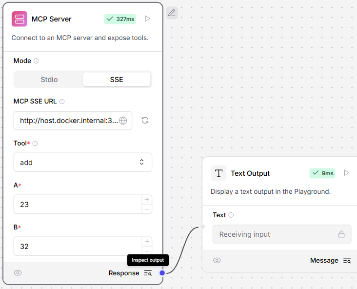

https://github.com/modelcontextprotocol/python-sdk

## Prerequisites
- Python 3.7+

## Installation
0. Initialize the project (assume "pip install uv" in main python):
```bash
python -m uv init mcp-server-demo
```

```bash
cd mcp-server-demo
```

1. Install the required dependencies (first time only):

   ```bash
   python -m uv add "mcp[cli]"
   ```
   
   or (second time onwards):
   ```bash
   python -m uv sync
   ```

2. Initialize server.py (first time only):

```python
# server.py
from mcp.server.fastmcp import FastMCP

# Create an MCP server
mcp = FastMCP("Demo")


# Add an addition tool
@mcp.tool()
def add(a: int, b: int) -> int:
    """Add two numbers"""
    return a + b


# Add a dynamic greeting resource
@mcp.resource("greeting://{name}")
def get_greeting(name: str) -> str:
    """Get a personalized greeting"""
    return f"Hello, {name}!"
```

## Usage

Run the MCP server:
```bash
.venv\Scripts\activate
```

```bash
mcp dev server.py
```
Then open http://127.0.0.1:6274 in your browser to access the MCP server.


## Claude installation
```bash
mcp install server.py
```

Or manually add the MCP server to Claude:

```bash
    "Demo": {
      "command": "uv",
      "args": [
        "run",
        "--with",
        "mcp[cli]",
        "mcp",
        "run",
        "D:\\code\\mcp\\mcp-server-demo\\server.py"
      ]
    }
```

Or run in STDIO mode:
```bash
uv run --with mcp mcp run server.py
```

*Both requires uv installation
```bash
powershell -ExecutionPolicy ByPass -c "irm https://astral.sh/uv/install.ps1 | iex"
```

# To access locally hosted MCP Server from docker hosted langflow
Run in SSE mode:
```bash
python server.py
```
Access from langflow MCP component in SSE mode:
```bash
http://host.docker.internal:3001/sse
```
